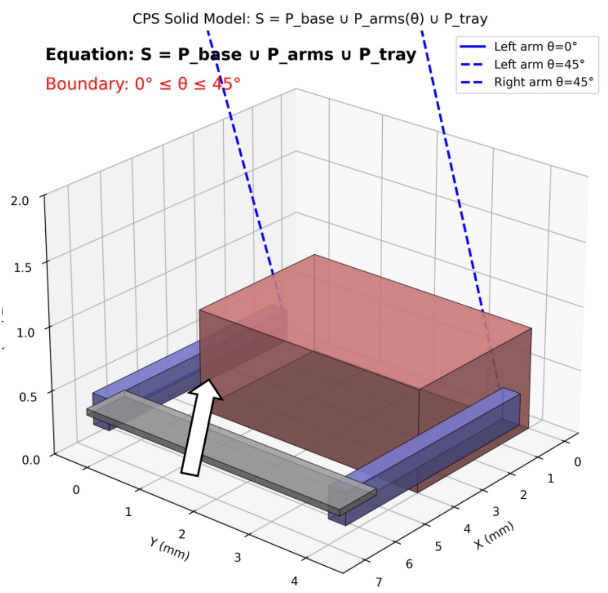

# CPS Clinical Data Actuation (ALAMEDA Dataset)

## 概要
パーキンソン病患者の臨床データ（ALAMEDAデータセット）の特定周波数（6.68Hz）を、mBot2を用いて物理空間へ転写するサイバーフィジカルシステム（CPS）。

## このプロジェクトで発揮したスキル
- **データの正規化と変換:** 非線形なデータセットから特徴周波数を抽出し、制御ロジックへ最適化するデータ処理能力。
- **堅牢な制御ロジック:** 物理的な故障を防ぐ「非浸透境界条件（Constraint）」をプログラムで実装し、システム全体の安全性を担保する設計。
- **実機実装能力:** 抽象的な要件をハードウェアの制限下で動作させる、実装重視のプログラミング。

## 成果物
- [x] Python制御アルゴリズム（位相幾何拘束による制御）
- [x] 非浸透境界条件による安全設計（0° <= θ <= 45°）
- [x] 物理空間への身体的疾患モデル再現

## システム構成

## 実行方法（参考）
mBot2環境下において、Pythonモードでの実行を想定。
- 動作環境: mBlock (Python Mode)
- 依存モジュール: cyberpi, mbot2
※物理的な機材がない場合、コードレビューによりアルゴリズムの整合性を確認可能。

## 技術的ポイント
- 疾患モデルの身体化（情報の身体化）
- 物理的慣性を相殺するパルス制御アルゴリズム
- リアルタイム性の担保

## 今後の展望
現在は単一の支配的周波数の再現を行っていますが、今後は不規則な震えのパターン（非定常信号）の再現に向けた適応的制御アルゴリズムの検討を予定しています。

## 参考文献・謝辞
ALAMEDA Parkinson's Disease Accelerometer Dataset URL：
https://zenodo.org/records/15769959

DOI：https://doi.org/10.5281/zenodo.15769959

Citation：

Papagiannakis, N., Stefanis, . leonidas ., Giannakopoulou, K.-M., Tsakanikas, P., Maga-Nteve, C., National and Kapodistrian University of Athens, Institute of Communication and Computer Systems, & Centre for Research and Technology Hellas. (2025). ALAMEDA Parkinson's Disease Accelerometer Dataset [Data set]. Zenodo. https://doi.org/10.5281/zenodo.15769959

